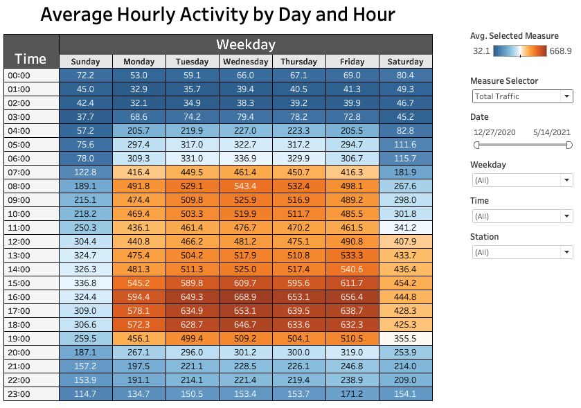
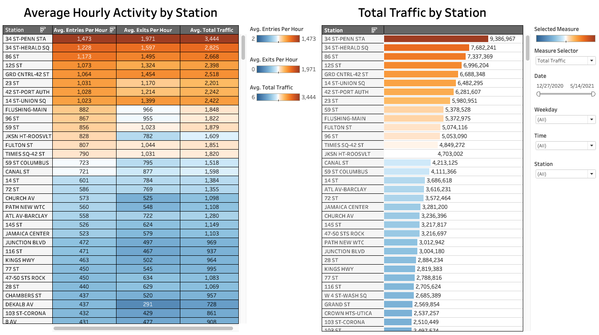

## MTA Analysis Minimum Viable Product

The goal for my project is to provide interactive dashboards that allow for digging into activity trends both in total and at individual stations. 

By providing access to data, MTA customers can help to smooth activity at MTA's stations by avoiding busier times when possible. The dashboard screenshot below shows how customers can filter for the stations they need to use and explore the busiest times of the day/week for a given date range.

MTA employees may also want to dig into trends to plan staffing, consider adding/removing stations and/or turnstiles, etc. The dashboard screenshot below shows how the user can sort by station. The "Measure Selector" allows for the user to select "Entries," "Exits," "Total Traffic," or "Net Flow." They could further dig into specific weekdays, times of day, or date ranges.

